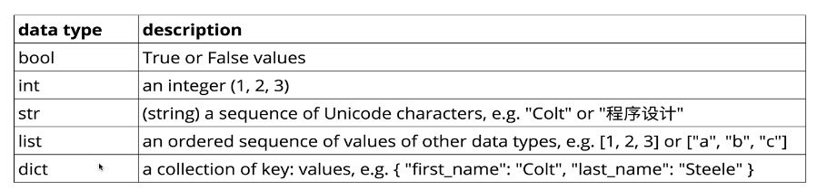

# Notes on PyBootCamp

## Variables and Strings

- Variables can be assigned to other variables
```
x = 100 # x is equal to 100
x = y # now x is equal to y
y = 50 # now y is equal to 15
all, at, once = 5, 10, 15 # all =5, at =10, and once = 15
```

- must start with letter or underscore
  - rest of variable must contain letters number or underscores (no hipghens)
- Names are case sensitive (e.g. cats != Cats)

### Conventions

- Use snake case, use underscore to separate words (e.g. snake_case not camelCase or snakeCase)
- MOST variables should be lower case
  - CAPITAL_SNAKE_CASE should refer to constants, like PI = 3.14
- UpperCamelCase refers to a class
- variables that start and end with two underscores (dunder) are supposed to be private or left alone
  - \_\_do_not_touch\_\_

### Data Types



- Booleans will start with a capital, e.g. True and False
    - i_won = False
- Strings (string = "8" or some_string = "bro")
- Very easy to reassign variables to different types
```
variable = True # a booleans
print(variable)
True
variable = "bro" # now it's a string!
print(variable)
bro
```

- In other languages you have to __declare__ what type of variable you are using, not the case in Python
- __None__ is Python's version of null


## Second section
