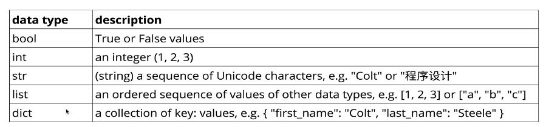

# Notes on PyBootCamp

## Variables and Strings

- Variables can be assigned to other variables
```
x = 100 # x is equal to 100
x = y # now x is equal to y
y = 50 # now y is equal to 15
all, at, once = 5, 10, 15 # all =5, at =10, and once = 15
```

- must start with letter or underscore
  - rest of variable must contain letters number or underscores (no hipghens)
- Names are case sensitive (e.g. cats != Cats)

### Conventions

- Use snake case, use underscore to separate words (e.g. snake_case not camelCase or snakeCase)
- MOST variables should be lower case
  - CAPITAL_SNAKE_CASE should refer to constants, like PI = 3.14
- UpperCamelCase refers to a class
- variables that start and end with two underscores (dunder) are supposed to be private or left alone
  - \_\_do_not_touch\_\_

### Data Types



- Booleans will start with a capital, e.g. True and False
    - i_won = False
- Strings (string = "8" or some_string = "bro")
- Very easy to reassign variables to different types
```
variable = True # a booleans
print(variable)
True
variable = "bro" # now it's a string!
print(variable)
bro
```

- In other languages you have to __declare__ what type of variable you are using, not the case in Python
- __None__ is Python's version of null
- You can convert data types by using functions, e.g.
```
decmail = 12.132141242
integer = int(decimal) # 12
```
- When in doubt you can do type(variable) and it will tell you the type of variable it is

### More on Strings

- can either be single or double quotes, doesn't matter, but you should be consistent
  - to put quotes inside of quotes you would have to do something like:  string = 'I am "funny"'
- Escape characters within strings get interpeted by python in unique ways, like adding a return within a string, they all start with backslashes "\"
  - \n will create a new line
- Concatenation
- F-Strings:  Allow you to use {} to insert variables into strings, e.g. ```fstring = f"I've told you {x} times!"```
  - Old way was to do it this way ```oldstring = "I've told you {} times {}!".format(10, already)```
- Strings are actually lists, so if you use the word "to" the 0th spot in the list is the letter "t", and the 1st letter is "o"
  - e.g. name = "Scott", ```print(name[1]) # this will return 'c'``` 


## Booleans and Conditional Logic

Learning how to get user input in Python

Truthiness and falsiness, any string is inherintly truthy, if a string is empty though, it is falsy. 

- Can combine IF statements by using and, or, not.  

- is vs. "=="
  - == checks values 'is' checks to see if they are referring to the exact same thing (same place in memory)

